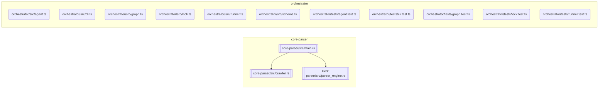

# Codebase Documentation

<!-- NEXUS_START:OVERVIEW -->
### Core Project Overview
This project, **nexus-readme**, is designed to automate documentation scanning.
It includes entrypoints like: None found.
<!-- NEXUS_END:OVERVIEW -->

<!-- NEXUS_START:GRAPH -->

<!-- NEXUS_END:GRAPH -->

<!-- NEXUS_START:ARCHITECTURE -->
### Quickstart Guide
1. **Build the Rust static core:**
   ```bash
   cargo build --release
   ```
2. **Execute the TypeScript Orchestrator:**
   ```bash
   npm run build && npm run test
   ```
<!-- NEXUS_END:ARCHITECTURE -->

<!-- NEXUS_START:REFERENCE -->
### Module Reference Table
| Module File | Language | Exports |
| --- | --- | --- |
| `core-parser/src/crawler.rs` | rust | `WorkspaceCrawler` (struct), `new` (function), `crawl` (function), `CrawlerVisitor` (struct), `CrawlerVisitorBuilder` (struct) |
| `core-parser/src/main.rs` | rust | `Args` (struct), `GitMetadata` (struct), `TopologyModule` (struct), `CodebaseTopology` (struct) |
| `core-parser/src/parser_engine.rs` | rust | `ExportInfo` (struct), `ParsedModule` (struct), `ASTAnalyzer` (struct), `new` (function), `detect_language` (function), `analyze_file` (function) |
| `orchestrator/src/agent.ts` | typescript | `AgentPipelineOptions` (interface), `GenerationResult` (interface), `runAgentPipeline` (function) |
| `orchestrator/src/cli.ts` | typescript | `main` (function) |
| `orchestrator/src/graph.ts` | typescript | `generateMermaidGraph` (function) |
| `orchestrator/src/lock.ts` | typescript | `patchReadme` (function) |
| `orchestrator/src/runner.ts` | typescript | `RunnerOptions` (interface), `BinaryRunnerError` (class), `resolveBinaryPath` (function), `runParserBinary` (function) |
| `orchestrator/src/schema.ts` | typescript | `CodebaseTopology` (type) |
| `orchestrator/tests/agent.test.ts` | typescript | None |
| `orchestrator/tests/cli.test.ts` | typescript | None |
| `orchestrator/tests/graph.test.ts` | typescript | None |
| `orchestrator/tests/lock.test.ts` | typescript | None |
| `orchestrator/tests/runner.test.ts` | typescript | None |
<!-- NEXUS_END:REFERENCE -->
