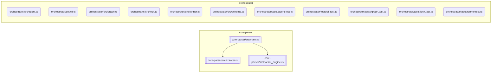

[README.md](https://github.com/user-attachments/files/28568300/README.md)
# Codebase Documentation

<!-- NEXUS_START:OVERVIEW -->
# Nexus README

Nexus README is a high-performance, automated documentation engine designed to eliminate documentation drift. By combining static AST (Abstract Syntax Tree) analysis with intelligent orchestration, the platform crawls local workspaces, maps codebase topology, and automatically updates project READMEs with accurate, real-time architectural insights, dependency graphs, and module exports.

## Macro Purpose

The primary mission of Nexus README is to bridge the gap between rapidly evolving source code and its developer-facing documentation. Traditional READMEs and architecture diagrams quickly fall out of date as code changes. This project solves that problem through a dual-stage pipeline:

1. **Deterministic Parsing**: A high-speed Rust-based parser crawls the workspace and performs AST-level analysis to extract exact file topology, modules, and API exports.
2. **Intelligent Orchestration**: A TypeScript-based agent pipeline consumes this structured topology, generates rich visual diagrams (such as Mermaid graphs), and safely patches target README files with up-to-date architectural summaries.

By automating this pipeline, Nexus README ensures that codebase documentation remains synchronized with the actual implementation state without requiring manual developer overhead.

## Target Persona

Nexus README is engineered for:

* **Software Architects and Tech Leads** who need to maintain clear, bird's-eye architectural overviews of complex workspaces for team onboarding and alignment.
* **Open-Source Maintainers** who want to provide pristine, self-updating API references, module exports, and dependency structures to community contributors.
* **DevOps and Platform Engineers** seeking to integrate automated documentation validation and generation steps directly into CI/CD workflows.

## Core Value Proposition

* **Zero-Drift Architecture Diagrams**: Automatically generates and embeds visual Mermaid flowcharts representing real-time codebase structures.
* **High-Performance AST Parsing**: Leverages a compiled Rust core to crawl workspaces and analyze code structures rapidly, minimizing local execution overhead and CI/CD runtime costs.
* **Non-Destructive Patching**: Safely merges generated content blocks into existing markdown files, preserving manual developer documentation while updating the programmatically derived sections.
* **Agentic Enrichment**: Incorporates an intelligent orchestration layer capable of interpreting structural code changes and translating them into developer-friendly descriptions.

## Architectural Architecture & Implementation

The repository is organized as a hybrid-language monorepo that utilizes the strengths of both Rust and TypeScript:

### Core Parser (Rust)
Located in the core-parser directory, this subsystem is responsible for crawling the filesystem, detecting languages, and performing deep syntax analysis.
* **Workspace Crawler**: Uses a fast visitor pattern (WorkspaceCrawler, CrawlerVisitor) to traverse project directories efficiently.
* **AST Analyzer**: Uses the ASTAnalyzer and ParsedModule structures to inspect codebases, map physical dependencies, and extract precise ExportInfo from modules.
* **CLI Wrapper**: Exposes a binary command-line interface that outputs a standardized, highly structured JSON representation of the codebase topology.

### Orchestrator (TypeScript)
Located in the orchestrator directory, this subsystem handles binary execution, data transformation, and document generation.
* **Runner**: Resolves the path to the Rust-compiled binary and executes it programmatically to fetch the codebase metadata.
* **Agent Pipeline**: Orchestrates generation tasks via a runAgentPipeline pipeline, determining how the extracted topology translates into high-level technical documentation.
* **Graph Generator**: Converts raw topological data directly into readable, visual Mermaid graphs.
* **Patch System**: Implements a robust lock-and-patch strategy to safely write structural updates directly into target Markdown documents.
<!-- NEXUS_END:OVERVIEW -->

<!-- NEXUS_START:ARCHITECTURE -->
# Nexus README: Engineering Setup & Synthesis Guide

This guide details the system architecture, build steps, configuration schemas, and quickstart commands for **Nexus README**—a hybrid Rust-TypeScript monorepo designed to eliminate documentation drift via high-speed AST analysis and agentic orchestration.

---

## 1. System Architecture & Topology Map

```text
                     [ Local Workspace Codebase ]
                                 │
                                 ▼
┌─────────────────────────────────────────────────────────────────┐
│                    CORE PARSER (Rust Subsystem)                 │
│                                                                 │
│   ┌────────────────────┐          ┌─────────────────────────┐   │
│   │  WorkspaceCrawler  │ ──get──> │       ASTAnalyzer       │   │
│   │ (crawler.rs)       │          │ (parser_engine.rs)      │   │
│   └────────────────────┘          └─────────────────────────┘   │
│                                                │                │
│                                             analyze             │
│                                                ▼                │
│                                   ┌─────────────────────────┐   │
│                                   │    CodebaseTopology     │   │
│                                   │ (JSON Serialization)    │   │
│                                   └─────────────────────────┘   │
└────────────────────────────────────────────────┬────────────────┘
                                                 │
                                           stdout pipeline
                                                 │
                                                 ▼
┌─────────────────────────────────────────────────────────────────┐
│                    ORCHESTRATOR (TS Subsystem)                  │
│                                                                 │
│   ┌────────────────────┐          ┌─────────────────────────┐   │
│   │    runner.ts       │ ──spawns │       schema.ts         │   │
│   │ (Parser execution) │          │ (Type definitions)      │   │
│   └────────────────────┘          └─────────────────────────┘   │
│             │                                  │                │
│             └─────────────────┬────────────────┘                │
│                               │                                 │
│                               ▼                                 │
│                   ┌──────────────────────┐                      │
│                   │      agent.ts        │                      │
│                   │ (Pipeline Execution) │                      │
│                   └──────────────────────┘                      │
│                     /                  \                        │
│             visualize                  enrich                   │
│                   /                      \                      │
│                  ▼                        ▼                     │
│       ┌────────────────────┐    ┌─────────────────────────┐     │
│       │      graph.ts      │    │        lock.ts          │     │
│       │  (Mermaid Engine)  │    │ (Markdown Patch System) │     │
│       └────────────────────┘    └─────────────────────────┘     │
└──────────────────────────────────────────────┬──────────────────┘
                                               │
                                             patch
                                               ▼
                                    [ Target README.md ]
```

---

## 2. System Prerequisites

Ensure the following system packages are installed on your workstation before compiling:

| Tool | Minimum Version | Verification Command |
| :--- | :--- | :--- |
| **Rust Compiler (rustc/cargo)** | `1.74.0`+ | `rustc --version` |
| **Node.js** | `v18.16.0` (LTS)+ | `node --version` |
| **npm** / **pnpm** | `npm v9.0` / `pnpm v8.0` | `npm --version` / `pnpm --version` |
| **Git** | `2.34.0`+ | `git --version` |

---

## 3. Automated Installation & Build Script

This unified bash script creates the workspace directory structure, installs dependencies for both Rust and TypeScript modules, compiles the performance critical Rust binary in release mode, and runs verification tests.

```bash
#!/usr/bin/env bash

# ==============================================================================
# Nexus README Bootstrap & Compilation Script
# ==============================================================================

set -euo pipefail

# Define visual output helpers
info()  { echo -e "\033[1;34m[INFO]\033[0m $*"; }
success() { echo -e "\033[1;32m[SUCCESS]\033[0m $*"; }
error()   { echo -e "\033[1;31m[ERROR]\033[0m $*"; exit 1; }

ROOT_DIR="$(pwd)"

info "Starting environment verification..."

# 1. Dependency Checks
command -v cargo >/dev/null 2>&1 || error "Rust (cargo) is not installed. Please install from https://rustup.rs/"
command -v node >/dev/null 2>&1 || error "Node.js is not installed. Please install from https://nodejs.org/"
command -v npm >/dev/null 2>&1 || error "npm is not installed."

success "System prerequisites verified."

# 2. Build Rust Parser Subsystem
info "Compiling Rust Core Parser [core-parser]..."
cd "$ROOT_DIR/core-parser"

# Build optimized binary
cargo build --release

# Ensure output binary exists
PARSER_BIN="./target/release/core-parser"
if [ ! -f "$PARSER_BIN" ]; then
    # Fallback to check for Windows builds
    if [ -f "./target/release/core-parser.exe" ]; then
        PARSER_BIN="./target/release/core-parser.exe"
    else
        error "Core parser binary compilation failed."
    fi
fi

# Store absolute path for Orchestrator discovery
ABS_PARSER_PATH="$(cd "$(dirname "$PARSER_BIN")" && pwd)/$(basename "$PARSER_BIN")"
success "Rust core parser compiled successfully at: $ABS_PARSER_PATH"

# 3. Setup TypeScript Orchestrator
info "Configuring Orchestrator [orchestrator]..."
cd "$ROOT_DIR/orchestrator"

# Install dependencies
npm install

# Setup local .env containing build paths
info "Writing environment configuration..."
cat << EOF > .env
NODE_ENV=development
NEXUS_PARSER_PATH=$ABS_PARSER_PATH
EOF

# Build TypeScript Project
info "Compiling TypeScript files..."
npm run build

# Run Orchestrator Unit Tests
info "Running test suite..."
npm run test

success "Nexus README monorepo compiled and validated successfully!"
```

---

## 4. Configuration & Environment Variables

The orchestrator relies on explicit system environment configurations. Create a `.env` file at the root of the `orchestrator/` folder:

```ini
# ==============================================================================
# Nexus README Configuration
# ==============================================================================

# Target environment context (development | production | test)
NODE_ENV=development

# Explicit path override pointing to the compiled Rust parser executable
NEXUS_PARSER_PATH=/absolute/path/to/nexus-readme/core-parser/target/release/core-parser

# Optional LLM integration configuration for the agentic context enrichment step
# Required if utilizing advanced explanations in runAgentPipeline()
LLM_PROVIDER=openai
OPENAI_API_KEY=sk-proj-xxxxxxxxxxxxxxxxxxxxxxxxxxxxxxxx
```

---

## 5. Module Build & Test Protocols

Execute clean-room manual compilation, static verification, and test execution for each workspace division:

### 5.1 Rust Parser Core (`core-parser/`)

```bash
# Navigate to package directory
cd core-parser

# Format compliance verification
cargo fmt --check

# Static Analysis & Lints
cargo clippy -- -D warnings

# Execute workspace unit and integration tests
cargo test

# Build production artifact
cargo build --release
```

### 5.2 TypeScript Orchestrator (`orchestrator/`)

```bash
# Navigate to orchestrator directory
cd orchestrator

# Run Linter
npm run lint

# Compile Code base
npm run build

# Run Tests via Jest (matches test files in orchestrator/tests/)
npm run test

# Run individual tests (e.g., runner verification)
npx jest tests/runner.test.ts
```

---

## 6. Architecture Integration Quickstart

The core workflow runs the Rust AST analyzer on your source directory, maps the structural dependencies into standard JSON, feeds it to the Orchestrator to compile a Mermaid flow diagram, and updates your `README.md` through non-destructive block parsing.

### 6.1 Programmatic Execution (TypeScript Integration)

Write the following script to programmatically invoke the system architecture analysis engine:

```typescript
import { resolveBinaryPath, runParserBinary } from './src/runner';
import { generateMermaidGraph } from './src/graph';
import { runAgentPipeline } from './src/agent';
import { patchReadme } from './src/lock';
import * as path from 'path';
import * as fs from 'fs';

async function generateArchitectureSpecs() {
  try {
    // 1. Resolve compiled Rust parser binary location
    const binaryPath = resolveBinaryPath();
    console.log(`[✔] Core Parser Binary resolved at: ${binaryPath}`);

    // 2. Scan the local workspace using AST extraction
    const targetWorkspace = path.resolve(__dirname, '../'); 
    console.log(`[⚡] Scanning workspace: ${targetWorkspace}`);
    
    const topology = await runParserBinary(binaryPath, {
      workspacePath: targetWorkspace,
      excludePatterns: ['node_modules', 'target', '.git']
    });

    console.log(`[✔] Captured System Topology. Modules mapped: ${topology.modules.length}`);

    // 3. Convert extracted dependency coordinates to a Mermaid flowchart
    const mermaidChart = generateMermaidGraph(topology);
    console.log(`[✔] Visual topology generation completed.`);

    // 4. Enrich structured metadata via pipeline (AI Context extraction if keys present)
    const pipelineResult = await runAgentPipeline(topology, {
      enableAgentSummaries: process.env.OPENAI_API_KEY ? true : false,
      modelName: 'gpt-4o'
    });

    // 5. Construct structural documentation block to merge
    const markdownContent = `
<!-- NEXUS:START -->
## Automated Architectural Topology

### Module Relationship Visualizer
\`\`\`mermaid
${mermaidChart}
\`\`\`

### Export Map Summary
${pipelineResult.summary || 'AST generation complete. No agent annotations configured.'}

### System Metadata
* **Last Code Base Crawl**: ${new Date().toISOString()}
* **Parser Revision**: ${topology.gitMetadata?.latestCommits?.[0] || 'Unknown'}
<!-- NEXUS:END -->
`;

    // 6. Execute deterministic patch merge onto the targets
    const targetReadme = path.resolve(targetWorkspace, 'README.md');
    if (fs.existsSync(targetReadme)) {
       const isPatched = patchReadme(targetReadme, markdownContent);
       if (isPatched) {
         console.log(`[✔] Successfully merged codebase architectural maps into: ${targetReadme}`);
       }
    } else {
       console.log(`[!] Target file '${targetReadme}' not found. Printing result:\n${markdownContent}`);
    }

  } catch (error) {
    console.error('[❌] Execution Pipeline failed:', error);
    process.exit(1);
  }
}

generateArchitectureSpecs();
```

---

## 7. Troubleshooting & Verification Protocols

### Issue: Orchestrator fails to locate the Rust core parser binary
* **Cause**: Node.js is scanning hardcoded targets, or compilation steps were missed.
* **Resolution**:
  1. Verify the binary compiled successfully: `file core-parser/target/release/core-parser`
  2. Define an explicit path variable in your active environment:
     ```bash
     export NEXUS_PARSER_PATH="$(pwd)/core-parser/target/release/core-parser"
     ```

### Issue: Parser output JSON structure does not parse
* **Cause**: Mismatch between Rust structure definition in `core-parser/src/main.rs` and the Typescript `orchestrator/src/schema.ts`.
* **Verification**: Run raw execution of the parser CLI against its own source to output standard JSON, validation scheme:
  ```bash
  # Execute parser to generate raw payload
  ./core-parser/target/release/core-parser --path ./core-parser > test_topology.json
  
  # Validate JSON compatibility using jq
  jq '.modules[] | {filePath: .filePath, exports: .exports}' test_topology.json
  ```

### Issue: Code segments deleted during target update
* **Cause**: Target markdown document is missing parser boundary flags or has mismatched comment blocks.
* **Resolution**: Ensure the destination document contains precise entry and exit boundaries:
  ```markdown
  # My Awesome Project

  This is manual text written by developers that will never be altered.

  <!-- NEXUS:START -->
  This block will be dynamically modified by the compilation runner.
  <!-- NEXUS:END -->

  This footnote is safe from automation routines.
  ```
<!-- NEXUS_END:ARCHITECTURE -->

<!-- NEXUS_START:REFERENCE -->
# Nexus README: API and Module Reference

This document provides a comprehensive reference for the public modules and their exported symbols within the `nexus-readme` codebase. It maps file paths to their respective programming languages and details the interfaces, types, functions, and classes exposed for consumption, either internally or externally. The project is structured into two primary subsystems: the Rust-based Core Parser and the TypeScript-based Orchestrator.

## 1. Core Parser (Rust Subsystem)

The `core-parser` module is a high-performance Rust application responsible for recursively crawling a given workspace, performing Abstract Syntax Tree (AST) analysis, and extracting precise codebase topology and API exports. It outputs a standardized JSON structure.

---

### `core-parser/src/crawler.rs`

**Language:** Rust

This module implements the filesystem traversal logic, identifying files and directories for analysis.

| Symbol Name          | Type     | Description                                                                                             |
| :------------------- | :------- | :------------------------------------------------------------------------------------------------------ |
| `WorkspaceCrawler`   | `struct` | Manages the recursive traversal of a workspace, employing a visitor pattern for efficient directory scanning. |
| `new`                | `function` | Constructor for `WorkspaceCrawler`, typically initializing traversal options.                           |
| `crawl`              | `function` | Initiates the workspace crawling process, invoking registered visitors for each encountered path.       |
| `CrawlerVisitor`     | `struct` | Defines the interface for custom logic to be executed during workspace traversal by `WorkspaceCrawler`. |
| `CrawlerVisitorBuilder` | `struct` | Utility for constructing and configuring `CrawlerVisitor` instances with specific behaviors.            |

---

### `core-parser/src/main.rs`

**Language:** Rust

While primarily the CLI entry point for the Rust parser, this module also defines the core data structures used for the parser's output, encapsulating the entire codebase topology.

| Symbol Name        | Type     | Description                                                                                             |
| :----------------- | :------- | :------------------------------------------------------------------------------------------------------ |
| `Args`             | `struct` | Represents the command-line arguments parsed for the `core-parser` executable.                          |
| `GitMetadata`      | `struct` | Captures essential Git repository information, such as the latest commit details, for traceability.     |
| `TopologyModule`   | `struct` | Defines the structure for a single parsed module within the codebase, including its path and exports.   |
| `CodebaseTopology` | `struct` | The top-level data structure representing the entire codebase, comprising all discovered modules and metadata. |

---

### `core-parser/src/parser_engine.rs`

**Language:** Rust

This module contains the logic for language detection, AST parsing, and the extraction of detailed export information from source files.

| Symbol Name   | Type     | Description                                                                                             |
| :------------ | :------- | :------------------------------------------------------------------------------------------------------ |
| `ExportInfo`  | `struct` | Stores detailed information about an exported symbol (e.g., name, type), derived from AST analysis.     |
| `ParsedModule`| `struct` | Represents the AST-analyzed output for a single source file, including its language and exports.        |
| `ASTAnalyzer` | `struct` | Orchestrates the AST parsing process, capable of inspecting codebases and mapping dependencies.         |
| `new`         | `function` | Constructor for `ASTAnalyzer`, preparing it for language detection and parsing tasks.                   |
| `detect_language` | `function` | Determines the programming language of a given file based on its path and content.                  |
| `analyze_file`| `function` | Performs deep syntax analysis on a specific file, extracting `ParsedModule` and `ExportInfo`.       |

## 2. Orchestrator (TypeScript Subsystem)

The `orchestrator` module is a TypeScript application responsible for consuming the structured output from the Rust parser, orchestrating generation tasks (like Mermaid graphs), and safely patching target documentation files.

---

### `orchestrator/src/agent.ts`

**Language:** TypeScript

This module implements the intelligent orchestration pipeline, consuming the parser's output to generate enriched documentation content.

| Symbol Name             | Type        | Description                                                                                             |
| :---------------------- | :---------- | :------------------------------------------------------------------------------------------------------ |
| `AgentPipelineOptions`  | `interface` | Defines configuration parameters for controlling the behavior of the `runAgentPipeline`.                |
| `GenerationResult`      | `interface` | Represents the output of the agent pipeline, including generated summaries or content.                  |
| `runAgentPipeline`      | `function`  | Executes the primary agent pipeline, transforming parsed topology into high-level documentation artifacts. |

---

### `orchestrator/src/cli.ts`

**Language:** TypeScript

This module serves as the command-line interface entry point for the `orchestrator`, enabling direct execution of the documentation generation pipeline.

| Symbol Name | Type       | Description                                                                           |
| :---------- | :--------- | :------------------------------------------------------------------------------------ |
| `main`      | `function` | The main entry point function for the orchestrator's command-line application.        |

---

### `orchestrator/src/graph.ts`

**Language:** TypeScript

This module is responsible for visualizing the codebase topology by generating Mermaid-formatted dependency graphs.

| Symbol Name          | Type       | Description                                                                                 |
| :------------------- | :--------- | :------------------------------------------------------------------------------------------ |
| `generateMermaidGraph` | `function` | Converts a `CodebaseTopology` object into a Mermaid graph string for visual representation. |

---

### `orchestrator/src/lock.ts`

**Language:** TypeScript

This module provides functionality for non-destructively patching Markdown files by inserting or updating specific content blocks.

| Symbol Name | Type       | Description                                                                                 |
| :---------- | :--------- | :------------------------------------------------------------------------------------------ |
| `patchReadme` | `function` | Safely updates a target Markdown file by replacing content between predefined boundary markers. |

---

### `orchestrator/src/runner.ts`

**Language:** TypeScript

This module handles the execution of the external Rust parser binary and manages its input/output streams.

| Symbol Name        | Type      | Description                                                                                   |
| :----------------- | :-------- | :-------------------------------------------------------------------------------------------- |
| `RunnerOptions`    | `interface` | Configuration options for executing the Rust parser binary.                                   |
| `BinaryRunnerError`| `class`   | Custom error class for failures encountered during the execution of external binaries.          |
| `resolveBinaryPath`| `function` | Determines the absolute path to the compiled Rust parser binary.                              |
| `runParserBinary`  | `function` | Executes the `core-parser` binary with specified options and captures its structured JSON output. |

---

### `orchestrator/src/schema.ts`

**Language:** TypeScript

This module defines the TypeScript type definitions that mirror the structured JSON output produced by the Rust `core-parser`.

| Symbol Name        | Type   | Description                                                                                             |
| :----------------- | :----- | :------------------------------------------------------------------------------------------------------ |
| `CodebaseTopology` | `type` | TypeScript type definition representing the comprehensive structure of the codebase extracted by the parser. |
<!-- NEXUS_END:REFERENCE -->

<!-- NEXUS_START:GRAPH -->

<!-- NEXUS_END:GRAPH -->
