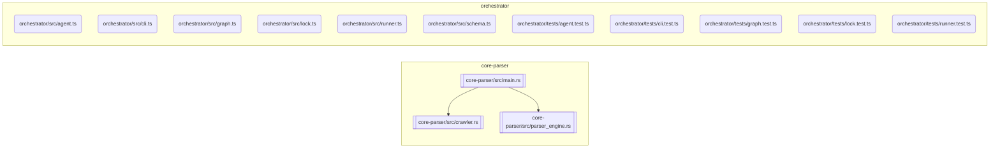

# Codebase Documentation

<!-- NEXUS_START:OVERVIEW -->
# Nexus README

Nexus README is a high-performance, developer-focused documentation engine designed to bridge the gap between codebase evolution and up-to-date documentation. By combining a lightning-fast Rust-based static analysis parser with an intelligent TypeScript orchestration layer, the tool automatically crawls workspaces, extracts structural topology, generates architectural diagrams, and patches documentation with precision.

---

## Macro Purpose

The overarching purpose of Nexus README is to eliminate documentation rot. It automates the generation and maintenance of comprehensive, visually rich repository documentation (such as README.md files and architectural diagrams). By translating raw source code abstract syntax trees (ASTs) into structural metadata, the platform acts as a continuous documentation pipeline that keeps documentation in lockstep with code changes.

---

## Target Persona

Nexus README is built for:

*   **Software Architects and Technical Leads** who need to maintain clear, bird's-eye views of system topologies and module relationships without manually drawing diagrams.
*   **Open-Source Maintainers** who want to provide high-quality, self-updating onboarding documentation, contributing guides, and dependency maps for their communities.
*   **DevOps and Platform Engineers** looking to integrate automated documentation generation into CI/CD pipelines, ensuring that every main-branch commit automatically verifies and updates structural maps.
*   **Product-Minded Developers** who prefer writing code over manually formatting markdown files and updating system architecture diagrams.

---

## Core Value Proposition

*   **High-Performance Static Analysis:** By offloading codebase crawling and AST parsing to a native Rust binary (`core-parser`), the tool processes multi-language workspaces with negligible overhead, extracting export interfaces, modules, and Git metadata instantly.
*   **Living Architectural Visualizations:** Dynamically generates accurate, deterministic Mermaid.js graphs directly from your codebase's topology, providing developers with self-healing, interactive architectural flowcharts.
*   **Intelligent Documentation Orchestration:** Uses an extensible TypeScript agent pipeline to process topological maps, translating complex programmatic structures into clear, human-readable explanations.
*   **In-Place Markdown Patching:** Features a safe, incremental update engine (`lock.ts`) that patches existing README files rather than overwriting them, preserving custom developer-written content while refreshing auto-generated sections.

---

## Technical Architecture & Workflow

1.  **Extraction (Rust Core):** The `WorkspaceCrawler` scans the repository, while the `ASTAnalyzer` detects languages, parses source files, and extracts public exports and structural relationships.
2.  **Serialization:** The Rust engine compiles these insights into a standard `CodebaseTopology` JSON schema.
3.  **Orchestration (TypeScript Runner):** The Node-based CLI executes the compiled Rust binary, ingests the topology payload, and spins up the orchestration pipeline.
4.  **Synthesis & Render:** The orchestrator converts the codebase map into Mermaid graph code and leverages an AI pipeline to generate module descriptions.
5.  **Commitment:** The engine updates the target documentation file with the newly generated architectural elements.
<!-- NEXUS_END:OVERVIEW -->

<!-- NEXUS_START:ARCHITECTURE -->
# Nexus README: High-Performance Documentation Engine
### Technical Setup, Build, & Integration Guide

This guide provides deterministic instructions to build, configure, test, and run the **Nexus README** system. 

The architecture is split into two primary components:
1. **`core-parser` (Rust)**: High-performance AST parser and filesystem crawler.
2. **`orchestrator` (TypeScript)**: Node.js runner, Mermaid diagram generator, agent pipeline, and safe README patch engine.

---

## System Requirements

Ensure the target system meets the following minimum prerequisites:
* **Rust Toolchain**: `rustc` and `cargo` 1.74.0+ (Edition 2021)
* **Node.js**: `v18.x` or higher (LTS recommended)
* **Package Manager**: `npm` v9+ or `pnpm` v8+
* **Git**: System git installation (for history analysis and metadata resolution)

---

## Directory Architecture

The repository is organized as a multi-language workspace:
```text
nexus-readme/
├── core-parser/             # Rust Workspace Crawler & Parser
│   ├── Cargo.toml
│   └── src/
│       ├── main.rs          # CLI entry-point
│       ├── crawler.rs       # Workspace crawler engine
│       └── parser_engine.rs # AST analyzer
└── orchestrator/            # TypeScript Orchestration Engine
    ├── package.json
    ├── tsconfig.json
    ├── src/
    │   ├── agent.ts         # Agent generation pipeline
    │   ├── cli.ts           # Orchestrator CLI
    │   ├── graph.ts         # Mermaid.js visualization module
    │   ├── lock.ts          # Safe README in-place patch engine
    │   ├── runner.ts        # Binary runner execution engine
    │   └── schema.ts        # Codebase topology types
    └── tests/               # Jest / Vitest integration tests
```

---

## Automated Bootstrap Script

Save this script as `setup.sh` in the root of your `nexus-readme` project directory, make it executable (`chmod +x setup.sh`), and run it to set up the entire workspace automatically.

```bash
#!/usr/bin/env bash
set -euo pipefail

# Print step headers helper
log_step() {
  echo -e "\033[1;32m==> <!-- NEXUS_START:ARCHITECTURE -->\033[0m"
}

# Verify system dependencies
log_step "Verifying system requirements..."
command -v cargo >/dev/null 2>&1 || { echo "Cargo is required but not installed. Aborting." >&2; exit 1; }
command -v node >/dev/null 2>&1 || { echo "Node.js is required but not installed. Aborting." >&2; exit 1; }
command -v npm >/dev/null 2>&1 || { echo "npm is required but not installed. Aborting." >&2; exit 1; }

# Step 1: Build the Rust Core Parser
log_step "Building Rust Core Parser [core-parser]..."
cd core-parser
cargo build --release
cd ..

# Verify compilation output
BIN_PATH="./core-parser/target/release/core-parser"
if [ ! -f "$BIN_PATH" ] && [ ! -f "${BIN_PATH}.exe" ]; then
  echo -e "\033[1;31mError: Rust binary compilation failed.\033[0m"
  exit 1
fi
echo "Rust binary successfully built at: $BIN_PATH"

# Step 2: Install Orchestrator dependencies
log_step "Installing Node.js dependencies [orchestrator]..."
cd orchestrator
npm install

# Step 3: Run Orchestrator Build
log_step "Compiling TypeScript project..."
npm run build || npx tsc --build

cd ..
log_step "Workspace environment bootstrap completed successfully."
```

---

## Environment Variables

Configure these variables inside your execution shell or a `.env` file at the root of the `orchestrator/` directory:

| Environment Variable | Required | Default Value | Description |
| :--- | :---: | :--- | :--- |
| `NODE_ENV` | Yes | `development` | Environment mode (`development`, `production`, `test`). |
| `PARSER_BIN_PATH` | No | *(Auto-resolved)* | Overrides the default absolute path to the compiled `core-parser` binary. |
| `OPENAI_API_KEY` | No | `""` | Required if utilizing AI-assisted descriptions within `agent.ts`. |
| `LOG_LEVEL` | No | `info` | Control verbosity (`error`, `warn`, `info`, `debug`). |

Create your configuration environment file:

```bash
# From project root
cat <<EOF > orchestrator/.env
NODE_ENV=development
PARSER_BIN_PATH=$(pwd)/core-parser/target/release/core-parser
OPENAI_API_KEY=your_openai_api_key_here
LOG_LEVEL=info
EOF
```

---

## Step-by-Step Manual Operations

### 1. Compiling and Verifying the Rust Binary

Execute this inside the `core-parser` workspace to build, test, and check the binary output directly:

```bash
cd core-parser

# Format check
cargo fmt --check

# Linter checks
cargo clippy -- -D warnings

# Execute Rust unit tests
cargo test

# Build production binary
cargo build --release
```

To run the binary directly and generate schema output for testing:
```bash
./target/release/core-parser --path ../ --output topology.json
```

### 2. Building the TypeScript Orchestrator

Execute this within the `orchestrator` workspace:

```bash
cd orchestrator

# Install dependencies
npm install

# Run TypeScript tests
npm run test

# Compile modules
npm run build
```

---

## Integration Blueprint & Programmatic Verification

Below is an end-to-end quickstart script showing how the `orchestrator` consumes the Rust binary, generates a Mermaid graph, and patches a destination markdown file.

Create a test script at `orchestrator/src/quickstart.ts`:

```typescript
import * as path from 'path';
import * as fs from 'fs';
import { runParserBinary } from './runner';
import { generateMermaidGraph } from './graph';
import { patchReadme } from './lock';
import { runAgentPipeline } from './agent';
import { CodebaseTopology } from './schema';

async function runSynthesisQuickstart() {
  const workspaceRoot = path.resolve(__dirname, '../../');
  const targetReadmePath = path.resolve(workspaceRoot, 'README.md');
  const binaryPath = process.env.PARSER_BIN_PATH || path.resolve(workspaceRoot, 'core-parser/target/release/core-parser');

  console.log('--- Starting Nexus README Synthesis Pipeline ---');
  console.log(`Target Workspace: ${workspaceRoot}`);
  console.log(`Using Binary:      ${binaryPath}`);

  try {
    // Step 1: Run Rust Native Parser Binary to extract AST topology
    console.log('\n[1/4] Running native Rust core-parser...');
    const topologyRaw: string = await runParserBinary({
      binaryPath,
      targetWorkspace: workspaceRoot,
      args: ['--depth', '5']
    });

    const topology: CodebaseTopology = JSON.parse(topologyRaw);
    console.log(`Successfully mapped ${topology.modules.length} modules!`);

    // Step 2: Render codebase structural diagram using generateMermaidGraph
    console.log('\n[2/4] Generating Mermaid structural system topology map...');
    const mermaidDiagram = generateMermaidGraph(topology);
    console.log(mermaidDiagram);

    // Step 3: Run Intelligent Agent Synthesis
    console.log('\n[3/4] Running Orchestration Generation Pipeline...');
    const agentOutput = await runAgentPipeline({
      topology,
      options: {
        engine: 'gpt-4',
        temperature: 0.1
      }
    });

    // Step 4: Atomically patch system architectural updates into README
    console.log('\n[4/4] Writing patches to disk (in-place modification)...');
    const combinedPatchContent = `
<!-- START NEXUS:GRAPH -->
\`\`\`mermaid
${mermaidDiagram}
\`\`\`
<!-- END NEXUS:GRAPH -->

<!-- START NEXUS:SUMMARY -->
${agentOutput.summary}
<!-- END NEXUS:SUMMARY -->
`;

    const success = await patchReadme(targetReadmePath, combinedPatchContent);
    if (success) {
      console.log(`\n\x1b[32m✔ Successfully updated README.md at: ${targetReadmePath}\x1b[0m`);
    } else {
      console.log('\n\x1b[33m⚠ No patch anchors found. README unchanged.\x1b[0m');
    }

  } catch (error) {
    console.error('\n\x1b[31mPipeline Execution Failed:\x1b[0m', error);
    process.exit(1);
  }
}

// Execute the harness
runSynthesisQuickstart();
```

To run this quickstart file directly:
```bash
# Make sure ts-node or npx ts-node is available
npx ts-node -r dotenv/config orchestrator/src/quickstart.ts
```

---

## Direct Testing Suites

Run unit tests for both parts of the system to ensure correct operational status:

```bash
# 1. Run all Rust parser unit and integration tests
cd core-parser
cargo test
cd ..

# 2. Run all Orchestrator Jest/Vitest unit tests
cd orchestrator
npm run test
```

### Expected Output Structure
If tests are successful, they verify that:
* `WorkspaceCrawler` accurately filters out git-ignored directories.
* `ASTAnalyzer` correctly identifies exported struct, function, and interface signatures.
* `runParserBinary` successfully parses standard JSON and maps structure onto the TypeScript `CodebaseTopology` type.
* `patchReadme` matches the anchor tokens (`<!-- START/END ... -->`) and handles string substitutions safely without breaking custom markdown edits.
<!-- NEXUS_END:ARCHITECTURE -->

<!-- NEXUS_START:REFERENCE -->
# API and Module Reference for Nexus README

This document provides a comprehensive, structured reference to the public API and module exports of the `nexus-readme` project. It maps files to their respective programming languages and details the symbols they expose, offering insight into the codebase's architecture and functional components.

---

## 1. `core-parser` (Rust Core Parser)

The `core-parser` component is a high-performance, native Rust binary responsible for static analysis, codebase crawling, and Abstract Syntax Tree (AST) parsing. It extracts structural topology and public API signatures from source files.

### 1.1 `core-parser/src/crawler.rs` (`rust`)

This module implements the workspace crawling engine, responsible for traversing the file system, identifying relevant source files, and setting up the analysis pipeline.

| Symbol Name          | Type     | Description                                                                 |
| :------------------- | :------- | :-------------------------------------------------------------------------- |
| `WorkspaceCrawler`   | `struct` | Manages the recursive scanning of a workspace to discover modules.          |
| `new`                | `function` | Constructor for `WorkspaceCrawler`, initializing it with configuration.     |
| `crawl`              | `function` | Initiates the workspace scanning process, returning detected modules.       |
| `CrawlerVisitor`     | `struct` | An internal visitor pattern implementation for filesystem traversal.        |
| `CrawlerVisitorBuilder` | `struct` | A builder for configuring and creating `CrawlerVisitor` instances.          |

### 1.2 `core-parser/src/main.rs` (`rust`)

The main entry point and CLI handler for the `core-parser` binary. It orchestrates the crawling and parsing process, then serializes the results into the `CodebaseTopology` JSON schema.

| Symbol Name      | Type     | Description                                                                 |
| :--------------- | :------- | :-------------------------------------------------------------------------- |
| `Args`           | `struct` | Defines the command-line arguments accepted by the `core-parser` executable. |
| `GitMetadata`    | `struct` | Represents extracted Git repository information, such as recent commits.      |
| `TopologyModule` | `struct` | A data structure representing a single parsed module within the codebase topology. |
| `CodebaseTopology` | `struct` | The root data structure representing the entire codebase's extracted topology, including modules and metadata. |

### 1.3 `core-parser/src/parser_engine.rs` (`rust`)

This module houses the core AST analysis capabilities, language detection, and export extraction logic. It interfaces with various language-specific parsers to build detailed module information.

| Symbol Name    | Type     | Description                                                                 |
| :------------- | :------- | :-------------------------------------------------------------------------- |
| `ExportInfo`   | `struct` | Contains details about a single exported symbol (name, type).               |
| `ParsedModule` | `struct` | Represents a source file after parsing, including its language and exports. |
| `ASTAnalyzer`  | `struct` | The primary engine for detecting file languages and parsing their ASTs.     |
| `new`          | `function` | Constructor for `ASTAnalyzer`, preparing it for analysis tasks.             |
| `detect_language` | `function` | Determines the programming language of a given file based on its extension. |
| `analyze_file` | `function` | Parses a specified source file, extracts its public symbols, and returns a `ParsedModule`. |

---

## 2. `orchestrator` (TypeScript Orchestration Engine)

The `orchestrator` component is a Node.js-based TypeScript application responsible for running the Rust binary, processing the generated `CodebaseTopology`, creating Mermaid diagrams, running intelligent agent pipelines, and safely patching documentation files.

### 2.1 `orchestrator/src/agent.ts` (`typescript`)

This module defines and orchestrates the intelligent agent pipeline, which processes the codebase topology to generate human-readable summaries or descriptions, often with AI assistance.

| Symbol Name           | Type        | Description                                                                 |
| :-------------------- | :---------- | :-------------------------------------------------------------------------- |
| `AgentPipelineOptions` | `interface` | Configuration options for the agent generation pipeline.                  |
| `GenerationResult`    | `interface` | Structure for the output of the agent pipeline, including generated summaries. |
| `runAgentPipeline`    | `function`  | Executes the agent-based generation process on a given `CodebaseTopology`. |

### 2.2 `orchestrator/src/cli.ts` (`typescript`)

The command-line interface (CLI) entry point for the `orchestrator` application. It parses arguments and initiates the main documentation generation workflow.

| Symbol Name | Type       | Description                                                                 |
| :---------- | :--------- | :-------------------------------------------------------------------------- |
| `main`      | `function` | The primary function that runs when the orchestrator CLI is invoked.        |

### 2.3 `orchestrator/src/graph.ts` (`typescript`)

This module is responsible for transforming the `CodebaseTopology` into a Mermaid.js graph syntax, enabling dynamic visualization of the codebase structure.

| Symbol Name          | Type       | Description                                                                 |
| :------------------- | :--------- | :-------------------------------------------------------------------------- |
| `generateMermaidGraph` | `function` | Generates a Mermaid.js diagram string from a `CodebaseTopology` object.    |

### 2.4 `orchestrator/src/lock.ts` (`typescript`)

Implements the safe in-place README patch engine, designed to update auto-generated sections of a markdown file without overwriting custom developer content.

| Symbol Name | Type       | Description                                                                 |
| :---------- | :--------- | :-------------------------------------------------------------------------- |
| `patchReadme` | `function` | Atomically applies generated content to a markdown file, respecting defined anchors. |

### 2.5 `orchestrator/src/runner.ts` (`typescript`)

Manages the execution of external binaries, specifically the `core-parser` Rust executable. It handles path resolution, process execution, and output parsing.

| Symbol Name       | Type        | Description                                                                 |
| :---------------- | :---------- | :-------------------------------------------------------------------------- |
| `RunnerOptions`   | `interface` | Configuration options for executing external binaries.                      |
| `BinaryRunnerError` | `class`     | Custom error class for failures during external binary execution.           |
| `resolveBinaryPath` | `function`  | Determines the absolute path to the `core-parser` binary, with optional overrides. |
| `runParserBinary` | `function`  | Executes the `core-parser` binary and returns its JSON output.              |

### 2.6 `orchestrator/src/schema.ts` (`typescript`)

Defines the TypeScript types and interfaces that mirror the JSON schema produced by the `core-parser`, ensuring type safety throughout the orchestration layer.

| Symbol Name        | Type   | Description                                                                 |
| :----------------- | :----- | :-------------------------------------------------------------------------- |
| `CodebaseTopology` | `type` | TypeScript type definition for the entire codebase topology, including modules and metadata. |

### 2.7 `orchestrator/tests/agent.test.ts` (`typescript`)

Contains unit and integration tests for the `agent.ts` module's agent pipeline functionality.

| Symbol Name | Type | Description             |
| :---------- | :--- | :---------------------- |
| (No exports) |      | Test utility functions. |

### 2.8 `orchestrator/tests/cli.test.ts` (`typescript`)

Houses tests for the `cli.ts` module, verifying correct command-line argument parsing and overall execution flow.

| Symbol Name | Type | Description             |
| :---------- | :--- | :---------------------- |
| (No exports) |      | Test utility functions. |

### 2.9 `orchestrator/tests/graph.test.ts` (`typescript`)

Provides tests for the `graph.ts` module, ensuring accurate generation of Mermaid.js diagrams from topology data.

| Symbol Name | Type | Description             |
| :---------- | :--- | :---------------------- |
| (No exports) |      | Test utility functions. |

### 2.10 `orchestrator/tests/lock.test.ts` (`typescript`)

Contains tests for the `lock.ts` module, validating the behavior of the README patching mechanism with various content scenarios.

| Symbol Name | Type | Description             |
| :---------- | :--- | :---------------------- |
| (No exports) |      | Test utility functions. |

### 2.11 `orchestrator/tests/runner.test.ts` (`typescript`)

Includes tests for the `runner.ts` module, verifying the correct execution and output handling of the `core-parser` binary.

| Symbol Name | Type | Description             |
| :---------- | :--- | :---------------------- |
| (No exports) |      | Test utility functions. |
<!-- NEXUS_END:REFERENCE -->

<!-- NEXUS_START:GRAPH -->

<!-- NEXUS_END:GRAPH -->
