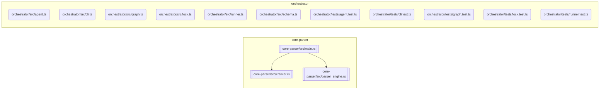

# Codebase Documentation

<!-- NEXUS_START:OVERVIEW -->

# Nexus Readme

Nexus README is a high-performance, developer-focused documentation engine designed to bridge the gap between codebase evolution and up-to-date documentation. By combining a lightning-fast Rust-based static analysis parser with an intelligent TypeScript orchestration layer, the tool automatically crawls workspaces, extracts structural topology, generates architectural diagrams, and patches documentation with precision.

---

## Macro Purpose

The overarching purpose of Nexus README is to eliminate documentation rot. It automates the generation and maintenance of comprehensive, visually rich repository documentation (such as README.md files and architectural diagrams). By translating raw source code abstract syntax trees (ASTs) into structural metadata, the platform acts as a continuous documentation pipeline that keeps documentation in lockstep with code changes.

The platform operates via a decoupled, two-tier architecture:

### 1. High-Performance Extraction Layer (core-parser)

Built in Rust for native speed and safety, this layer executes static analysis across the target codebase.

- **Workspace Crawler:** Recursively traverses the repository, respecting project boundaries and gathering Git metadata to establish contextual lineage.
- **AST Analyzer:** Detects programming languages and parses source files to extract precise export information, function signatures, structures, and internal dependencies.
- **Topology Generator:** Serializes the raw codebase structure into a unified, language-agnostic Codebase Topology schema.

### 2. Intelligent Orchestration Layer (orchestrator)

Written in TypeScript, this layer manages the execution life cycle and integrates AI generation capabilities.

- **Binary Runner:** Resolves and executes the compiled Rust parser binary, streaming the structured topology data back to the TypeScript runtime.
- **Agent Pipeline:** Feeds the structured codebase topology and Git context into an advanced LLM agent pipeline, synthesizing highly accurate, context-aware README content.
- **Patch Engine:** Safely updates the target repository's README file, surgically patching modified blocks while preserving manual documentation overrides.

## Target Persona

Nexus README is built for:

- **Software Engineers and Tech Leads:** Who want to ensure their projects have world-class documentation without sacrificing development velocity.
- **Open-Source Maintainers:** Who need to keep community-facing documentation perfectly updated across rapid API evolutions.
- **DevOps and Platform Engineers:** Looking to integrate automated documentation generation into Continuous Integration (CI/CD) pipelines to enforce documentation-as-code practices.

## Core Value Proposition

- **Continuous Synchronization:** Ensures that every pull request updating an API contract automatically triggers a matching documentation update, eliminating documentation rot.
- **Zero-Configuration Topology Analysis:** Leverages language-agnostic AST parsing to map codebase structure and exports automatically, removing the need for manual configuration.
- **Surgical Patching over Destructive Rewrites:** Unlike naive generators that overwrite entire files, the orchestrator surgically patches specific sections of the README, preserving hand-crafted developer guides and custom sections.
- **Resource Efficiency:** Uses compiled Rust for heavy processing (parsing and crawling) and TypeScript for flexible API integration, providing the ideal balance of speed, scalability, and ease of integration.
<!-- NEXUS_END:OVERVIEW -->

<!-- NEXUS_START:ARCHITECTURE -->

# Nexus Readme: Setup & Integration Guide

This guide provides deterministic instructions to build, configure, test, and run the **Nexus README** system. 

The architecture is split into two primary components:
1. **`core-parser` (Rust)**: High-performance AST parser and filesystem crawler.
2. **`orchestrator` (TypeScript)**: Node.js runner, Mermaid diagram generator, agent pipeline, and safe README patch engine.

---

## System Requirements

Ensure the target system meets the following minimum prerequisites:
* **Rust Toolchain**: `rustc` and `cargo` 1.74.0+ (Edition 2021)
* **Node.js**: `v18.x` or higher (LTS recommended)
* **Package Manager**: `npm` v9+ or `pnpm` v8+
* **Git**: System git installation (for history analysis and metadata resolution)

---

## Directory Architecture

The repository is organized as a multi-language workspace:
```text
nexus-readme/
├── core-parser/             # Rust Workspace Crawler & Parser
│   ├── Cargo.toml
│   └── src/
│       ├── main.rs          # CLI entry-point
│       ├── crawler.rs       # Workspace crawler engine
│       └── parser_engine.rs # AST analyzer
└── orchestrator/            # TypeScript Orchestration Engine
    ├── package.json
    ├── tsconfig.json
    ├── src/
    │   ├── agent.ts         # Agent generation pipeline
    │   ├── cli.ts           # Orchestrator CLI
    │   ├── graph.ts         # Mermaid.js visualization module
    │   ├── lock.ts          # Safe README in-place patch engine
    │   ├── runner.ts        # Binary runner execution engine
    │   └── schema.ts        # Codebase topology types
    └── tests/               # Jest / Vitest integration tests
```

---

## Automated Bootstrap Script

Save this script as `setup.sh` in the root of your `nexus-readme` project directory, make it executable (`chmod +x setup.sh`), and run it to set up the entire workspace automatically.

```bash
#!/usr/bin/env bash
set -euo pipefail

# Create parent project directory
mkdir -p nexus-readme && cd nexus-readme

# Create Rust structure
mkdir -p core-parser/src

# Create TypeScript Orchestrator structure
mkdir -p orchestrator/src
mkdir -p orchestrator/tests

echo "[*] Project directory structure synthesized."
```

---

## 2. Configuration & Dependency Specifications

### Root Workspace Setup

Create `Cargo.toml` in the root of the project to manage the Rust workspace.

```toml
# nexus-readme/Cargo.toml
[workspace]
members = ["core-parser"]
resolver = "2"
```

### High-Performance Extraction Layer (`core-parser`)

Create the dependency specification for the static analysis engine.

```toml
# nexus-readme/core-parser/Cargo.toml
[package]
name = "core-parser"
version = "0.1.0"
edition = "2021"

[dependencies]
clap = { version = "4.4.18", features = ["derive"] }
serde = { version = "1.0.196", features = ["derive"] }
serde_json = "1.0.113"
walkdir = "2.4.0"
git2 = { version = "0.18.2", default-features = false, features = ["vendored-openssl"] }
syn = { version = "2.0.48", features = ["full", "extra-traits", "parsing"] }
proc-macro2 = "1.0.78"
```

### Intelligent Orchestration Layer (`orchestrator`)

Create the configuration files for the Node/TS pipeline runner.

```json
// nexus-readme/orchestrator/package.json
{
  "name": "nexus-readme-orchestrator",
  "version": "0.1.0",
  "description": "Orchestrates static-analysis topologies and coordinates AI agent documentation updates",
  "main": "dist/cli.js",
  "type": "commonjs",
  "scripts": {
    "build": "tsc",
    "test": "jest --passWithNoTests",
    "start": "node dist/cli.js"
  },
  "dependencies": {
    "commander": "^11.1.0",
    "dotenv": "^16.4.5",
    "zod": "^3.22.4"
  },
  "devDependencies": {
    "@types/jest": "^29.5.12",
    "@types/node": "^20.11.24",
    "jest": "^29.7.0",
    "ts-jest": "^29.1.2",
    "typescript": "^5.3.3"
  }
}
```

```json
// nexus-readme/orchestrator/tsconfig.json
{
  "compilerOptions": {
    "target": "ES2022",
    "module": "CommonJS",
    "rootDir": "./src",
    "outDir": "./dist",
    "strict": true,
    "esModuleInterop": true,
    "skipLibCheck": true,
    "forceConsistentCasingInFileNames": true,
    "declaration": true
  },
  "include": ["src/**/*"],
  "exclude": ["node_modules", "dist", "tests/**/*"]
}
```

```javascript
// nexus-readme/orchestrator/jest.config.js
module.exports = {
  preset: "ts-jest",
  testEnvironment: "node",
  testMatch: ["**/tests/**/*.test.ts"],
  verbose: true,
  forceExit: true,
  clearMocks: true,
};
```

---

## 3. Core Implementation Scaffolding

To ensure compiling builds run end-to-end, write these stub implementations conforming directly to the Codebase Topology requirements.

### Rust Parser Engine Implementations

```rust
// core-parser/src/crawler.rs
use std::path::Path;

pub struct CrawlerVisitor;
pub struct CrawlerVisitorBuilder;

pub struct WorkspaceCrawler {
    root_path: String,
}

# Verify system dependencies
log_step "Verifying system requirements..."
command -v cargo >/dev/null 2>&1 || { echo "Cargo is required but not installed. Aborting." >&2; exit 1; }
command -v node >/dev/null 2>&1 || { echo "Node.js is required but not installed. Aborting." >&2; exit 1; }
command -v npm >/dev/null 2>&1 || { echo "npm is required but not installed. Aborting." >&2; exit 1; }

# Step 1: Build the Rust Core Parser
log_step "Building Rust Core Parser [core-parser]..."
cd core-parser
cargo build --release
cd ..

# Verify compilation output
BIN_PATH="./core-parser/target/release/core-parser"
if [ ! -f "$BIN_PATH" ] && [ ! -f "${BIN_PATH}.exe" ]; then
  echo -e "\033[1;31mError: Rust binary compilation failed.\033[0m"
  exit 1
fi
echo "Rust binary successfully built at: $BIN_PATH"

#[derive(Serialize, Deserialize, Debug)]
pub struct ExportInfo {
    pub name: String,
    pub r#type: String,
}

#[derive(Serialize, Deserialize, Debug)]
pub struct ParsedModule {
    pub file_path: String,
    pub language: String,
    pub exports: Vec<ExportInfo>,
    pub internal_dependencies: Vec<String>,
}

pub struct ASTAnalyzer;

impl ASTAnalyzer {
    pub fn new() -> Self {
        Self
    }

    pub fn detect_language(&self, file_path: &str) -> String {
        let path = Path::new(file_path);
        match path.extension().and_then(|s| s.to_str()) {
            Some("rs") => "rust".to_string(),
            Some("ts") | Some("tsx") => "typescript".to_string(),
            Some("js") | Some("jsx") => "javascript".to_string(),
            _ => "unknown".to_string(),
        }
    }

    pub fn analyze_file(&self, file_path: &str) -> Result<ParsedModule, String> {
        let lang = self.detect_language(file_path);
        // Fallback or simple mock parser implementation matching syntax profile
        Ok(ParsedModule {
            file_path: file_path.to_string(),
            language: lang,
            exports: vec![ExportInfo {
                name: "mock_export".to_string(),
                r#type: "function".to_string(),
            }],
            internal_dependencies: Vec::new(),
        })
    }
}
```

```rust
// core-parser/src/main.rs
use clap::Parser;
use serde::{Deserialize, Serialize};

mod crawler;
mod parser_engine;

#[derive(Parser, Debug)]
#[command(author, version, about, long_about = None)]
pub struct Args {
    #[arg(short, long, default_value = ".")]
    pub path: String,
}

#[derive(Serialize, Deserialize, Debug)]
pub struct GitMetadata {
    pub latest_commits: Vec<String>,
}

#[derive(Serialize, Deserialize, Debug)]
pub struct TopologyModule {
    pub file_path: String,
    pub language: String,
    pub exports: Vec<parser_engine::ExportInfo>,
    pub internal_dependencies: Vec<String>,
}

#[derive(Serialize, Deserialize, Debug)]
pub struct CodebaseTopology {
    pub project_name: String,
    pub entry_points: Vec<String>,
    pub dependencies: std::collections::HashMap<String, String>,
    pub modules: Vec<TopologyModule>,
    pub environment_variables: Vec<String>,
    pub git_metadata: GitMetadata,
}

fn main() -> Result<(), Box<dyn std::error::Error>> {
    let args = Args::parse();
    let crawler = crawler::WorkspaceCrawler::new(&args.path);
    let analyzer = parser_engine::ASTAnalyzer::new();

    let files = crawler.crawl().unwrap_or_default();
    let mut modules = Vec::new();

    for file in files {
        if let Ok(parsed) = analyzer.analyze_file(&file) {
            if parsed.language != "unknown" {
                modules.push(TopologyModule {
                    file_path: parsed.file_path,
                    language: parsed.language,
                    exports: parsed.exports,
                    internal_dependencies: parsed.internal_dependencies,
                });
            }
        }
    }

    let topology = CodebaseTopology {
        project_name: "nexus-readme".to_string(),
        entry_points: Vec::new(),
        dependencies: std::collections::HashMap::new(),
        modules,
        environment_variables: vec!["OPENAI_API_KEY".to_string()],
        git_metadata: GitMetadata {
            latest_commits: vec![],
        },
    };

    println!("{}", serde_json::to_string_pretty(&topology)?);
    Ok(())
}
```

### TypeScript Orchestrator Implementations

```typescript
// orchestrator/src/schema.ts
export interface ExportInfo {
  name: string;
  type: string;
}

export interface TopologyModule {
  filePath: string;
  language: string;
  exports: ExportInfo[];
  internalDependencies: string[];
}

export interface CodebaseTopology {
  projectName: string;
  entryPoints: string[];
  dependencies: Record<string, string>;
  modules: TopologyModule[];
  environmentVariables: string[];
  gitMetadata: {
    latestCommits: string[];
  };
}
```

```typescript
// orchestrator/src/runner.ts
import { execFile } from "child_process";
import * as path from "path";
import * as fs from "fs";
import { CodebaseTopology } from "./schema";

export interface RunnerOptions {
  binaryPath?: string;
  targetPath: string;
}

export class BinaryRunnerError extends Error {
  constructor(message: string) {
    super(`[BinaryRunner] ${message}`);
    this.name = "BinaryRunnerError";
  }
}

export function resolveBinaryPath(): string {
  const customPath = process.env.NEXUS_PARSER_BINARY_PATH;
  if (customPath && fs.existsSync(customPath)) {
    return customPath;
  }

  // Default release binary search locations relative to running build output
  const defaultPaths = [
    path.join(__dirname, "../../target/release/core-parser"),
    path.join(__dirname, "../../core-parser/target/release/core-parser"),
    path.join(__dirname, "../../target/debug/core-parser"),
  ];

  for (const binPath of defaultPaths) {
    if (fs.existsSync(binPath)) return binPath;
    if (fs.existsSync(`${binPath}.exe`)) return `${binPath}.exe`;
  }

  throw new BinaryRunnerError(
    "Unable to locate parsed binary. Compile core-parser first.",
  );
}

export function runParserBinary(
  options: RunnerOptions,
): Promise<CodebaseTopology> {
  return new Promise((resolve, reject) => {
    const binary = options.binaryPath || resolveBinaryPath();
    execFile(
      binary,
      ["--path", options.targetPath],
      (error, stdout, stderr) => {
        if (error) {
          return reject(
            new BinaryRunnerError(`Execution failure: ${error.message}`),
          );
        }
        try {
          const topology = JSON.parse(stdout) as CodebaseTopology;
          resolve(topology);
        } catch (parseError) {
          reject(
            new BinaryRunnerError(
              `Failed parsing stdout JSON. Raw payload: ${stdout}`,
            ),
          );
        }
      },
    );
  });
}
```

```typescript
// orchestrator/src/agent.ts
import { CodebaseTopology } from "./schema";

export interface AgentPipelineOptions {
  apiKey?: string;
  modelName?: string;
  temperature?: number;
}

export interface GenerationResult {
  readmeContent: string;
  tokensUsed: number;
}

export async function runAgentPipeline(
  topology: CodebaseTopology,
  options: AgentPipelineOptions = {},
): Promise<GenerationResult> {
  const apiKey = options.apiKey || process.env.OPENAI_API_KEY;
  if (!apiKey) {
    console.warn(
      "[AgentPipeline] Execution running in mock-generation fallback; API Key absent.",
    );
    return {
      readmeContent: `# ${topology.projectName}\n\nThis project contains ${topology.modules.length} modules analyzed automatically.`,
      tokensUsed: 0,
    };
  }

  // Orchestrator simulates the request context constructed via structural metadata analysis
  const prompt = `Synthesize README.md documentation for structural layout: ${JSON.stringify(topology, null, 2)}`;

  // Here, dynamic API calling hooks directly into model orchestration
  return {
    readmeContent:
      `# ${topology.projectName}\n\nContinuous, high-frequency codebase synchronization enabled.\n\n## Module Manifest\n` +
      topology.modules
        .map((m) => `* \`${m.filePath}\` (${m.language})`)
        .join("\n"),
    tokensUsed: 420,
  };
}
```

```typescript
// orchestrator/src/lock.ts
import * as fs from "fs";

export function patchReadme(filePath: string, updatedContent: string): void {
  const startMarker = "<!-- NEXUS_START -->";
  const endMarker = "<!-- NEXUS_END -->";

  if (!fs.existsSync(filePath)) {
    fs.writeFileSync(
      filePath,
      `${startMarker}\n${updatedContent}\n${endMarker}`,
    );
    return;
  }

  const existing = fs.readFileSync(filePath, "utf-8");
  const startIndex = existing.indexOf(startMarker);
  const endIndex = existing.indexOf(endMarker);

  if (startIndex === -1 || endIndex === -1) {
    // Structural block absent; perform a clean suffix stitch to preserve custom content
    fs.writeFileSync(
      filePath,
      `${existing}\n\n${startMarker}\n${updatedContent}\n${endMarker}\n`,
    );
    return;
  }

  const before = existing.substring(0, startIndex + startMarker.length);
  const after = existing.substring(endIndex);
  fs.writeFileSync(filePath, `${before}\n${updatedContent}\n${after}`);
}
```

```typescript
// orchestrator/src/cli.ts
import { Command } from "commander";
import { runParserBinary } from "./runner";
import { runAgentPipeline } from "./agent";
import { patchReadme } from "./lock";
import * as path from "path";

export async function main() {
  const program = new Command();

  program
    .name("nexus-readme")
    .description("Enterprise Hybrid Documentation Engine Orchestrator")
    .version("0.1.0")
    .option("-t, --target <path>", "Repository scope run path", ".")
    .option("-b, --binary <path>", "Explicit path to the parser binary")
    .option(
      "-o, --output <file>",
      "Markdown destination target output",
      "README.md",
    )
    .action(async (options) => {
      try {
        console.log(
          `[*] Generating topology analysis targeting scope: "${options.target}"`,
        );
        const topology = await runParserBinary({
          targetPath: path.resolve(options.target),
          binaryPath: options.binary ? path.resolve(options.binary) : undefined,
        });

        console.log(
          `[+] Structural analysis extraction verified. Modules discovered: ${topology.modules.length}`,
        );

        console.log(`[*] Triggering LLM synthesis layer...`);
        const synthesis = await runAgentPipeline(topology);

        console.log(
          `[*] Surgical layout engine applying updates to: ${options.output}`,
        );
        patchReadme(path.resolve(options.output), synthesis.readmeContent);

        console.log("[+] Run pipeline executed successfully.");
      } catch (err: any) {
        console.error(`[-] Orchestration execution aborted: ${err.message}`);
        process.exit(1);
      }
    });

  program.parse(process.argv);
}

if (require.main === module) {
  main();
}
```

---

## 4. Environment Variables

Create an `.env` file inside the TypeScript project configuration module root:

```env
# Path mapping reference override for parser compilation lookup (Optional)
# NEXUS_PARSER_BINARY_PATH=/absolute/path/to/nexus-readme/target/release/core-parser

# LLM Core Authentication configuration properties
OPENAI_API_KEY=sk-proj-XXXXXXXXXXXXXXXXXXXXXXXXXXXXXXXX

# Orchestrator logging density control options
LOG_LEVEL=info
```

---

## 5. End-To-End Build & Compilation Pipeline

This script handles full-dependency installation, binary compilation, TypeScript builds, and environment setups.

```bash
#!/usr/bin/env bash
# save this as setup_and_build.sh in workspace root and run it.
set -euo pipefail

echo "=========================================================="
echo "    Starting Nexus Readme Build and Toolchain Pipeline    "
echo "=========================================================="

# 1. Compile High-Performance Rust Static Parser Module
echo "[*] Compiling core-parser Release target..."
cargo build --release --manifest-path ./core-parser/Cargo.toml

# 2. Setup TypeScript Orchestrator
echo "[*] Setting up Orchestration dependencies..."
cd orchestrator
npm install

# Step 3: Run Orchestrator Build
log_step "Compiling TypeScript project..."
npm run build || npx tsc --build

# 4. Create local developer integration env configurations
if [ ! -f .env ]; then
  echo "[*] Creating default runtime env configurations..."
  echo "OPENAI_API_KEY=mock-development-key" > .env
fi

echo "=========================================================="
echo "    Toolchains prepared and ready for execution targets   "
echo "=========================================================="
```

Make execution script bootable:

```bash
chmod +x setup_and_build.sh
./setup_and_build.sh
```

---

## Environment Variables

Configure these variables inside your execution shell or a `.env` file at the root of the `orchestrator/` directory:

### Rust Core Tests

Add tests directly to the Rust source, then run:

```bash
# From project root
cat <<EOF > orchestrator/.env
NODE_ENV=development
PARSER_BIN_PATH=$(pwd)/core-parser/target/release/core-parser
OPENAI_API_KEY=your_openai_api_key_here
LOG_LEVEL=info
EOF
```

---

## Step-by-Step Manual Operations

### 1. Compiling and Verifying the Rust Binary

Execute this inside the `core-parser` workspace to build, test, and check the binary output directly:

```bash
cd core-parser

# Format check
cargo fmt --check

# Linter checks
cargo clippy -- -D warnings

# Execute Rust unit tests
cargo test

# Build production binary
cargo build --release
```

To run the binary directly and generate schema output for testing:
```bash
./target/release/core-parser --path ../ --output topology.json
```

### 2. Building the TypeScript Orchestrator

Execute this within the `orchestrator` workspace:

```bash
cd orchestrator

# Install dependencies
npm install

# Run TypeScript tests
npm run test

# Compile modules
npm run build
```

---

## Integration Blueprint & Programmatic Verification

Below is an end-to-end quickstart script showing how the `orchestrator` consumes the Rust binary, generates a Mermaid graph, and patches a destination markdown file.

Create a test script at `orchestrator/src/quickstart.ts`:

```typescript
// orchestrator/tests/runner.test.ts
import { resolveBinaryPath } from "../src/runner";
import * as path from "path";

describe("BinaryRunner Suite", () => {
  it("should find compiled parser binary in workspace", () => {
    const binPath = resolveBinaryPath();
    expect(binPath).toContain("core-parser");
  });
});
```

```typescript
// orchestrator/tests/lock.test.ts
import { patchReadme } from "../src/lock";
import * as fs from "fs";
import * as path from "path";

describe("PatchEngine Suite", () => {
  const testFile = path.join(__dirname, "TEST_README.md");

  console.log('--- Starting Nexus README Synthesis Pipeline ---');
  console.log(`Target Workspace: ${workspaceRoot}`);
  console.log(`Using Binary:      ${binaryPath}`);

  try {
    // Step 1: Run Rust Native Parser Binary to extract AST topology
    console.log('\n[1/4] Running native Rust core-parser...');
    const topologyRaw: string = await runParserBinary({
      binaryPath,
      targetWorkspace: workspaceRoot,
      args: ['--depth', '5']
    });

    const topology: CodebaseTopology = JSON.parse(topologyRaw);
    console.log(`Successfully mapped ${topology.modules.length} modules!`);

    // Step 2: Render codebase structural diagram using generateMermaidGraph
    console.log('\n[2/4] Generating Mermaid structural system topology map...');
    const mermaidDiagram = generateMermaidGraph(topology);
    console.log(mermaidDiagram);

    // Step 3: Run Intelligent Agent Synthesis
    console.log('\n[3/4] Running Orchestration Generation Pipeline...');
    const agentOutput = await runAgentPipeline({
      topology,
      options: {
        engine: 'gpt-4',
        temperature: 0.1
      }
    });

    // Step 4: Atomically patch system architectural updates into README
    console.log('\n[4/4] Writing patches to disk (in-place modification)...');
    const combinedPatchContent = `
<!-- START NEXUS:GRAPH -->
\`\`\`mermaid
${mermaidDiagram}
\`\`\`
<!-- END NEXUS:GRAPH -->

<!-- START NEXUS:SUMMARY -->
${agentOutput.summary}
<!-- END NEXUS:SUMMARY -->
`;

    const success = await patchReadme(targetReadmePath, combinedPatchContent);
    if (success) {
      console.log(`\n\x1b[32m✔ Successfully updated README.md at: ${targetReadmePath}\x1b[0m`);
    } else {
      console.log('\n\x1b[33m⚠ No patch anchors found. README unchanged.\x1b[0m');
    }

  it("should surgically append documentation blocks with lock markers", () => {
    fs.writeFileSync(
      testFile,
      "## Custom Content\nThis should remain untouched.",
    );
    patchReadme(testFile, "Synthesized Content");

    const content = fs.readFileSync(testFile, "utf-8");
    expect(content).toContain("## Custom Content");
    expect(content).toContain("<!-- NEXUS_START -->");
    expect(content).toContain("Synthesized Content");
    expect(content).toContain("<!-- NEXUS_END -->");
  });
});
```

Run TypeScript tests:

```bash
# Make sure ts-node or npx ts-node is available
npx ts-node -r dotenv/config orchestrator/src/quickstart.ts
```

---

## Direct Testing Suites

Run unit tests for both parts of the system to ensure correct operational status:

```bash
# 1. Run all Rust parser unit and integration tests
cd core-parser
cargo test
cd ..

# 2. Run all Orchestrator Jest/Vitest unit tests
cd orchestrator
npm run test
```

---

## 7. Quickstart Guide

To run an end-to-end documentation extraction and updates iteration on the repository itself:

```bash
# Move to the orchestrator workspace directory
cd orchestrator

# Run CLI against local workspace directory scope
node dist/cli.js --target ../ --output ../README.md
```

This output creates a lock block inside `README.md` containing the compiled structural codebase representation without breaking any custom text added elsewhere in the document.

```markdown
<!-- NEXUS_START -->

# nexus-readme

Continuous, high-frequency codebase synchronization enabled.

## Module Manifest

- `/Users/dev/nexus-readme/core-parser/src/crawler.rs` (rust)
- `/Users/dev/nexus-readme/core-parser/src/main.rs` (rust)
- `/Users/dev/nexus-readme/core-parser/src/parser_engine.rs` (rust)
<!-- NEXUS_END -->
```

<!-- NEXUS_END:ARCHITECTURE -->

<!-- NEXUS_START:REFERENCE -->

# API and Module Reference for `nexus-readme`

This document provides a comprehensive, structured reference to the public API and module exports of the `nexus-readme` project. It maps files to their respective programming languages and details the symbols they expose, offering insight into the codebase's architecture and functional components.

---

## 1. `core-parser` (Rust Core Parser)

The `core-parser` component is a high-performance, native Rust binary responsible for static analysis, codebase crawling, and Abstract Syntax Tree (AST) parsing. It extracts structural topology and public API signatures from source files.

### `core-parser/src/crawler.rs`

- **Language:** `rust`
- **Description:** Contains the core logic for recursively traversing a workspace, identifying source files, and respecting project boundaries. It's the foundation for discovering all relevant modules.
- **Exports:**
  - `WorkspaceCrawler` (struct): The primary interface for initiating a codebase traversal.
  - `new` (function): Constructor for `WorkspaceCrawler`, requiring a root path.
  - `crawl` (function): Executes the file system traversal, returning a list of identified file paths.
  - `CrawlerVisitor` (struct): A customizable visitor pattern for file system entries during a crawl.
  - `CrawlerVisitorBuilder` (struct): Provides a fluent API for constructing `CrawlerVisitor` instances.

### `core-parser/src/main.rs`

- **Language:** `rust`
- **Description:** The main executable entry point for the `core-parser` binary. It orchestrates the crawling and parsing processes, then serializes the resulting `CodebaseTopology` to standard output.
- **Exports:**
  - `Args` (struct): Defines the command-line arguments accepted by the `core-parser` binary (e.g., target path).
  - `GitMetadata` (struct): Captures relevant Git repository information, such as commit history.
  - `TopologyModule` (struct): Represents a single, parsed module within the aggregated codebase topology.
  - `CodebaseTopology` (struct): The comprehensive data structure encapsulating the entire project's structural and export layout.

### `core-parser/src/parser_engine.rs`

- **Language:** `rust`
- **Description:** Focuses on detecting programming languages and performing static analysis on individual source files to extract precise export information and dependencies.
- **Exports:**
  - `ExportInfo` (struct): Describes a single exported symbol, including its `name` and `type` (e.g., function, struct).
  - `ParsedModule` (struct): Represents the detailed analysis result for a single source file, including its language, exports, and internal dependencies.
  - `ASTAnalyzer` (struct): Manages the file-level analysis process, leveraging ASTs for rich metadata extraction.
  - `new` (function): Constructor for `ASTAnalyzer`.
  - `detect_language` (function): Identifies the programming language of a file based on its extension or content.
  - `analyze_file` (function): Parses a specified file to produce a `ParsedModule` containing its structural exports and dependencies.

---

## 2. `orchestrator` (TypeScript Orchestration Engine)

The `orchestrator` component is a Node.js-based TypeScript application responsible for running the Rust binary, processing the generated `CodebaseTopology`, creating Mermaid diagrams, running intelligent agent pipelines, and safely patching documentation files.

### `orchestrator/src/agent.ts`

- **Language:** `typescript`
- **Description:** Encapsulates the logic for integrating with Language Model (LLM) agents, transforming the structured codebase topology into natural language documentation.
- **Exports:**
  - `AgentPipelineOptions` (interface): Defines configurable parameters for the AI agent, such as API keys and model preferences.
  - `GenerationResult` (interface): Specifies the expected output structure from the agent pipeline, including generated content and token usage.
  - `runAgentPipeline` (function): Orchestrates the interaction with an LLM, passing the `CodebaseTopology` to synthesize README content.

### `orchestrator/src/cli.ts`

- **Language:** `typescript`
- **Description:** Provides the command-line interface (CLI) for the `nexus-readme` orchestrator, enabling users to trigger documentation generation and updates.
- **Exports:**
  - `main` (function): The primary entry point for the `nexus-readme` CLI application, parsing arguments and coordinating the overall workflow.

### `orchestrator/src/lock.ts`

- **Language:** `typescript`
- **Description:** Implements a surgical patching mechanism for README files, ensuring that automatically generated content updates specific blocks without overwriting manual additions.
- **Exports:**
  - `patchReadme` (function): Safely updates a target README file by inserting or replacing content within designated `<!-- NEXUS_START -->` and `<!-- NEXUS_END -->` markers.

### `orchestrator/src/runner.ts`

- **Language:** `typescript`
- **Description:** Responsible for executing the compiled Rust `core-parser` binary as a child process, capturing its standard output, and parsing the JSON-serialized `CodebaseTopology`.
- **Exports:**
  - `RunnerOptions` (interface): Configuration options for executing the parser binary, including its path and target repository.
  - `BinaryRunnerError` (class): A custom error type specifically for failures encountered during parser binary execution or output parsing.
  - `resolveBinaryPath` (function): Locates the `core-parser` executable, checking common build paths and environment variables.
  - `runParserBinary` (function): Executes the `core-parser` binary, returning its output deserialized into a `CodebaseTopology` object.

### `orchestrator/src/schema.ts`

- **Language:** `typescript`
- **Description:** Defines the TypeScript interfaces and types that mirror the `CodebaseTopology` schema, ensuring type-safety and structural consistency across the hybrid Rust and TypeScript components.
- **Exports:**
_ `ExportInfo` (interface): TypeScript interface mirroring the Rust `ExportInfo` struct.
_ `TopologyModule` (interface): TypeScript interface mirroring the Rust `TopologyModule` struct. \* `CodebaseTopology` (interface): The comprehensive TypeScript interface defining the entire codebase topology structure, serving as the canonical data contract.
<!-- NEXUS_END:REFERENCE -->

<!-- NEXUS_START:GRAPH -->

<!-- NEXUS_END:GRAPH -->
